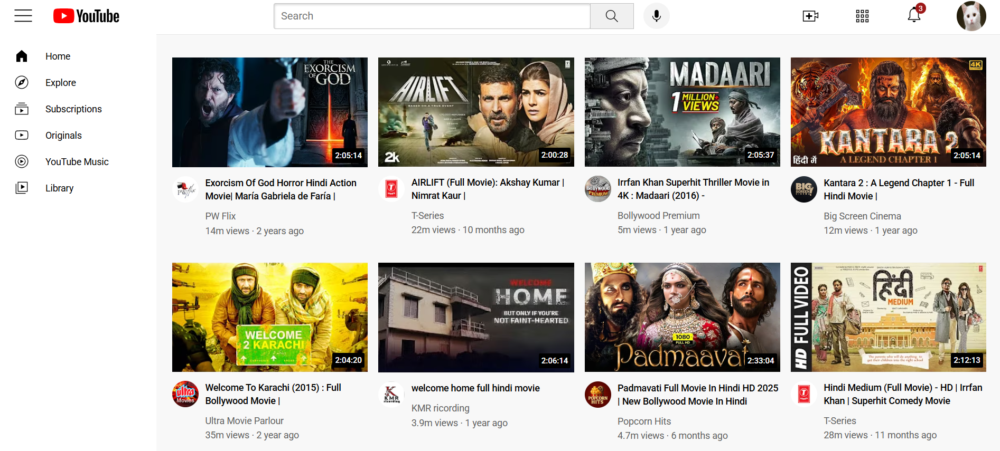

# 🎥 YouTube Clone Website

A responsive front-end YouTube clone built using **HTML and CSS**, deployed on **GitHub Pages**.

🔗 **Live Demo:**  
https://vansh777-pal.github.io/youtubeclone-website/

---

## 🚀 Features
- Responsive layout for desktop and mobile
- YouTube-style header and sidebar
- Video grid with hover effects
- Clean and modern UI
- Hosted using GitHub Pages

---

## 🛠️ Technologies Used
- HTML5
- CSS3 (Flexbox, Grid)
- GitHub Pages

---

## 📸 Screenshots

---

## 📌 What I Learned
- Building real-world front-end layouts
- Debugging CSS issues in deployed environments
- Making responsive UI using media queries
- Deploying static websites using GitHub Pages

---

## 👤 Author
**Vansh**  
GitHub: https://github.com/Vansh777-pal
